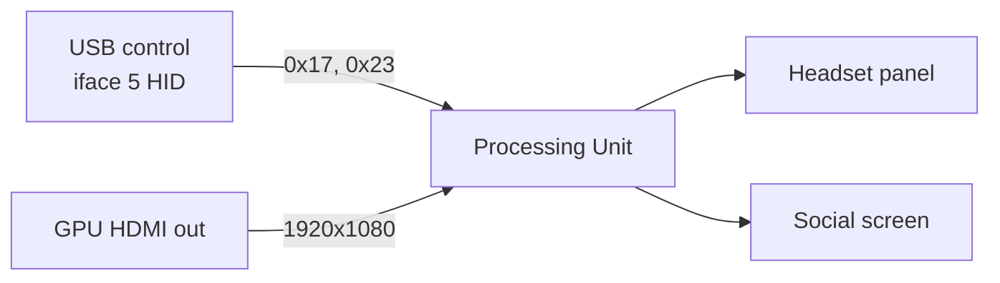

# PSVR1 as FPV Sim Display on Linux — Implementation Spec

As of 2026-09-19

---

## Scope and confidence

The PSVR1 can be driven as a plain HDMI display on Linux with roughly 30 lines of HID code; everything beyond that is optional. Two USB HID writes on interface 5 (power on, VR mode on) are the whole required protocol, and both are confirmed by two independent implementations plus the original reverse-engineering wiki.

Confidence levels used throughout:

- **Confirmed** — read directly in source code or in a device descriptor dump, and cross-checked against a second source.
- **Reported** — stated in one project's wiki, issue thread or README, not independently verified here.
- **Unknown** — explicitly flagged; the implementing agent must test on hardware.

Sources actually opened (not just search snippets): OpenHMD `drv_psvr` source, Monado `drv_psvr` source (via GitHub mirror `shinyquagsire23/monado`, upstream is on `gitlab.freedesktop.org`), and the [PSVRFramework wiki](https://github.com/gusmanb/PSVRFramework/wiki), which is the origin of most published PSVR protocol knowledge and was written by `gusmanb` and `mungewell` in 2016.

One open point worth stating up front: whether the headset's 90 Hz and 120 Hz modes can be reached on Linux is **not** settled by any source found. The EDID does not advertise them. This is the main hardware risk in the plan below.

---

## Hardware: USB and HDMI

The Processing Unit exposes one composite USB 2.0 device, `054c:09af`, with 9 interfaces; only interface 5 matters for us. HDMI is a completely separate path — the PU is an HDMI sink that the GPU sees as a 1080p monitor, and no video ever travels over USB for our purposes.

### USB device

`idVendor 0x054c` (Sony Computer Entertainment Inc.), `idProduct 0x09af` (`PlayStation®VR`), `bcdDevice 0x107`, self-powered, 9 interfaces. Full descriptor dump: [USB Interfaces](https://github.com/gusmanb/PSVRFramework/wiki/USB-Interfaces). Both OpenHMD (`SONY_ID 0x054c` / `PSVR_HMD 0x09af`) and Monado (`PSVR_VID` / `PSVR_PID` in `psvr_interface.h`) use these same IDs — **confirmed**.

| Iface | Class | String | Endpoints | Needed here |
| --- | --- | --- | --- | --- |
| 0 | Vendor | PS VR 3D Audio | iso OUT 0x01 | no |
| 1–3 | Audio | PS VR Audio / Mic / Chat | iso | no (handled by ALSA if wanted) |
| 4 | HID | PS VR Sensor | int IN 0x83, 64 B | no (IMU only) |
| **5** | **HID** | **PS VR Control** | **int IN 0x84, int OUT 0x04, 64 B** | **yes — the only one** |
| 6 | Vendor | PS VR H.264 | iso OUT 0x05 | no (social-screen video push) |
| 7 | Vendor | PS VR BulkIn | bulk IN 0x87, 512 B | no |
| 8 | HID | PS VR Control2 | int IN 0x86, int OUT 0x06 | no |

Monado names these `PSVR_HANDLE_IFACE 4` and `PSVR_CONTROL_IFACE 5`; OpenHMD opens the same two by `interface_number`. Interface 4 is the IMU stream and is **not** required for display-only use.

### Control protocol

Every control message is a 4-byte Sony header plus payload, written to the interface-5 HID OUT endpoint. Header: `[0]` command/register, `[1]` sub-register, `[2]` magic `0xAA`, `[3]` payload length (4, 8 or 16). Source: [USB Command Response Format](https://github.com/gusmanb/PSVRFramework/wiki/PSVR-Control:--USB-Command-Response-Format). The device answers with reports in the same format on the IN endpoint, and returns readable errors (`Bad R-ID`, `Bad Length`) when a command is malformed — useful during bring-up.

The two commands the project needs:

| Purpose | Bytes | Source |
| --- | --- | --- |
| Power / display on | `17 00 AA 04 01 00 00 00` | Monado `control_power_and_wait()` |
| Power off | `17 00 AA 04 00 00 00 00` | Monado, same function |
| VR mode on | `23 00 AA 04 01 00 00 00` | Monado `control_vrmode_and_wait()`, OpenHMD `psvr_vrmode_on` |
| Cinematic mode (VR mode off) | `23 00 AA 04 00 00 00 00` | OpenHMD `psvr_cinematicmode_on` |

**Contradiction found.** OpenHMD's `psvr_power_on` is `17 76 AA 04 01 00 00 00` — byte 1 is `0x76`, where Monado sends `0x00`. Both are reported to work, so byte 1 (the "sub-register") is apparently ignored for command `0x17`. Send `0x00` and note the discrepancy in a comment.

Status is reported back unsolicited as report `0xF0`, a 20-byte packet; byte 4 is a bitfield with bit 0 = powered on, bit 1 = HMD worn, bit 2 = cinematic mode, bit 4 = headphones. Monado polls for this after each command with a 1 ms sleep and a 5000-iteration cap, i.e. it waits up to 5 s for the headset to confirm. That poll-and-confirm loop is the only **timing requirement** found anywhere; no fixed delays are documented, and nothing must be sent periodically to keep the display alive — **no keepalive is present in either implementation**.

### HDMI and EDID

The PU contains two HDMI crossbar switches and behaves differently per mode ([Video routing and EDIDs](https://github.com/gusmanb/PSVRFramework/wiki/Video-routing-and-EDIDs)):

- **Cinematic mode** — the PU maps the incoming video onto a virtual cinema screen and applies its own head-rotation from the built-in IMU. The PC sends plain 2D 1080p and does nothing else. Social screen mirrors the input exactly.
- **VR mode** — the PU sends the incoming image *straight to the panel, unaltered*. All distortion must already be in the frame. This is the low-latency, full-FOV path and the one an FPV sim wants.

The EDID reported by the PU identifies as manufacturer `SNY`, model `b403`, monitor name `SCEI` (Windows tools show it as `SIE HMD`), max TMDS clock 150 MHz, and advertises **1920x1080@60 as native (CEA VIC 16)** plus 50/24 Hz, 1080i, 720p, 480p and 640x480. It does **not** advertise the panel's 90 Hz or 120 Hz modes. The EDID also changes depending on what is plugged into the social-screen output, so it is not a fixed blob.

HDCP: no source found states that the PU requires HDCP on its input, and PC users on Windows drive it from ordinary GPU outputs without HDCP negotiation — treat as **not required, unverified**. The PU's *output* toward a social-screen TV is a separate matter and irrelevant here.

One firm cabling rule from the Trinus PSVR setup notes: the PC's HDMI must go into the PU's **HDMI input**, and on a hybrid-graphics laptop the port used must be one the rendering GPU can actually drive; feeding the PU's HDMI *output* back to the PC produces a distorted image.

---

## Existing implementations

Four independent codebases send the same two commands, which is why the protocol can be treated as settled. None of them is worth depending on: each drags in a tracking stack, a fusion filter or a full VR runtime to deliver two HID writes.

| Project | Language | Scope | License | Reuse verdict |
| --- | --- | --- | --- | --- |
| [OpenHMD](https://github.com/OpenHMD/OpenHMD) | C, hidapi | HMD abstraction + IMU fusion; PSVR is one driver | BSL-1.0 | Code copyable; don't depend on it |
| [Monado `drv_psvr`](https://monado.pages.freedesktop.org/monado/group__drv__psvr.html) | C, hidapi | Fullest PSVR driver: power/VR-mode state machine, calibration, LEDs, distortion | BSL-1.0 | Best reference; copyable with attribution |
| [psvrd](https://github.com/ronsaldo/psvrd) | C, libusb | Userspace daemon + client lib + `psvrd_control` CLI | MIT | Closest architectural match |
| [pyPSVR](https://github.com/mungewell/pyPSVR) | Python, PyUSB | One script: on/off, VR/cinematic, LEDs, cinematic screen size | GPL-2.0 | Do **not** copy code |
| [PSVRFramework](https://github.com/gusmanb/PSVRFramework) | C#, Windows | The original reverse-engineering effort; source of the wiki | AGPL-3.0 | Do **not** copy code; wiki facts are fine |
| [OpenPSVR](https://github.com/alatnet/OpenPSVR) | C++, OpenVR | SteamVR driver, Windows-centric | unclear | Not useful here |

### What each contributes

**Monado** is the most careful implementation. `psvr_device.c` opens HID interfaces 4 and 5 by `interface_number`, then runs `control_power_and_wait(true)` followed by `control_vrmode_and_wait(true)`, each blocking on a `0xF0` status packet rather than a fixed sleep. That ordering — power first, VR mode second — is worth copying exactly. Everything after it (calibration read via `0x81`, LED control via `0x15`, `m_imu_3dof` fusion, panotools distortion constants) is tracking work we don't need.

**OpenHMD** does the same two writes with no confirmation loop and no error recovery, which is why its `psvr_power_on` byte-1 anomaly went unnoticed for years. Useful mainly as a second data point.

**psvrd** is the architecture this project should resemble, minus the daemon. It uses libusb directly: `libusb_kernel_driver_active()` → `libusb_detach_kernel_driver()` → `libusb_claim_interface(5)` → transfer to endpoint `0x04`. Note one oddity to *not* copy: psvrd calls `libusb_fill_bulk_transfer()` on what is an interrupt endpoint. Linux tolerates this, but `libusb_interrupt_transfer()` is the correct call.

**pyPSVR** is the single most useful artefact for this project, and not because of its USB code. Its `edid-hacking/hook_me_up.sh` is a working Linux recipe for the missing high-refresh modes, written by the same person who documented the EDID:

```
xrandr --newmode "1920x1080_120" 297.00 1920 2008 2052 2200 1080 1084 1089 1125 +HSync +Vsync
xrandr --newmode "1920x1080_90"  222.75 1920 2008 2052 2200 1080 1084 1089 1125 +HSync +Vsync
```

These reuse the EDID's own detailed timing (front/back porch `2008 2052 2200` / `1084 1089 1125`) and only scale the pixel clock: 148.5 MHz → 297.00 MHz for 120 Hz, 222.75 MHz for 90 Hz. That is a strong signal the panel's high-refresh modes are the same timing at a multiplied clock. **But** the EDID advertises a max TMDS clock of 150 MHz, so a 297 MHz mode exceeds what the sink claims to support and the driver may refuse it — see Known problems.

### Does display-only work?

Yes, independently reported. The OpenPSVR author writes in [issue #2](https://github.com/alatnet/OpenPSVR/issues/2) that with only start/stop and VR-mode switching implemented, the video display functionality worked well at 1080p120 with no tearing or ghosting, while head tracking was still entirely absent and orientation was spinning. That is precisely our target state.

[dylanmckay/psvr-protocol](https://github.com/dylanmckay/psvr-protocol) is a useful index of the wider ecosystem if the implementing agent needs more.

---

## Video path: five layers, we need one and a half

The USB link and the video link are fully independent. USB only changes the PU's *mode*; it never carries a frame. Once the mode is set, the PU is an ordinary HDMI sink and the kernel's DRM/KMS stack drives it with no special code at all.



| Layer | Needed? | Why |
| --- | --- | --- |
| USB control / init | **Yes** | Two HID writes; nothing happens without them |
| HDMI video transport | **Yes, but free** | Kernel DRM/KMS already does it; we only select a mode |
| Rendering | No | The FPV simulator renders |
| VR distortion / stereo | No (optional later) | See FPV section — real goggles are monoscopic |
| Tracking | **No** | Explicitly out of scope; VR mode works with a static image |

The critical, load-bearing claim: **the PU does not require any tracking data to display video.** In VR mode it passes the incoming frame to the panel untouched, and in cinematic mode it applies head rotation from the headset's own IMU internally. Neither path needs the PC to send pose data. Confirmed by the wiki's description of the PU's video routing and by the OpenPSVR report of working 1080p120 display with no tracking implemented.

So the project's entire job is: put the PU into the right mode over USB, then get out of the way.

---

## FPV-specific design

FPV goggles are **monoscopic**: one camera, one image, shown identically to both eyes. This is the single most important design fact, and it removes almost all the VR work. DVR Simulator, one of the few FPV sims with headset support, offers exactly this distinction — a monoscopic mode described as the same image on both eyes, like real goggles, and a separate stereo mode it warns will cause motion sickness.

That also settles the SteamVR/OpenXR question. Liftoff's own support pages state plainly that it does not support VR of any kind, arguing that racing goggles work quite differently from VR headsets. Building an OpenXR runtime for a target whose main applications deliberately don't use OpenXR would be effort spent in the wrong place.

### Two viable display modes

**Mode A — cinematic (recommended default).** Leave the PU in cinematic mode, optionally with the virtual screen locked so it doesn't drift with head movement. The PC sends plain 1920x1080 like any monitor. The PU handles lens distortion and screen placement itself. The simulator needs no changes whatsoever — it renders to what it thinks is a second monitor. This is, functionally, a pair of FPV goggles.

The cinematic screen is configured with report `0x21`, a 16-byte payload. From pyPSVR's parameter clamping: byte 0 is `0x00` when locked and `0x40` when free, byte 1 screen size (26–100, default 52), byte 2 distance (20–50, default 35), byte 3 "mist" (1–40, default 20), byte 10 brightness (1–32, default 20), byte 12 forced social-screen resolution (0–4). Report `0x1B` (`1B 00 AA 04 00 00 00 00`) recenters the screen. All of this is **reported, single-source** — treat the field meanings as provisional.

**Mode B — VR mode with a duplicated half-frame.** Switch the PU to VR mode, then render the FPV camera view twice side by side into one 1920x1080 frame, 960x1080 per eye. Full panel FOV, no PU processing, lowest latency. Costs: the sim must be told to render SBS (most won't), and without barrel pre-distortion the lenses will pincushion the image. A small GL/Vulkan fullscreen program that takes a source window or camera and writes an SBS frame, optionally with a radial distortion shader, covers this — but it is a later milestone, not the first one.

### What is not needed

No compositor, no SteamVR driver, no OpenXR runtime, no Monado. The PSVR appears in `xrandr` / `drm_info` as an ordinary 1080p output. A fullscreen window on that output is sufficient for both modes. One practical rule carried over from Windows setups: nothing else should be drawn on that output — no panels, no notifications, no second window.

---

## Spec 1 — Project description

`psvr-display` is a small Linux command-line utility that wakes a Sony PSVR1 Processing Unit over USB and puts it into a chosen display mode, so the headset can be used as an ordinary HDMI monitor for FPV drone simulators. It sends two HID commands and exits. Everything after that is the normal Linux graphics stack.

It is **not** a VR runtime, a SteamVR driver, an OpenXR provider, a compositor, or a tracking system. It does not read the IMU, does not talk to the PlayStation Camera, does not support Move controllers, and does not render anything. It does not require Monado, OpenHMD, SteamVR or Proton.

A later optional component, `psvr-sbs`, may render a side-by-side frame for VR mode. It is explicitly out of scope for the first release.

---

## Spec 2 — Game plan

Each step has one success criterion. Do not start step N+1 until step N passes.

1. **Repository init.** Create the layout from Spec 4, MIT or BSL-1.0 licence file, `pyproject.toml`, README stating scope. *Success: `pip install -e .` works and `psvr-display --help` prints usage.*

2. **Hardware detection.** Enumerate USB for `054c:09af`, print bus/address, configuration, and the 9 interface descriptors. Fail with a clear message if absent. *Success: `psvr-display probe` prints the descriptor tree and identifies interface 5 with endpoints `0x84` IN and `0x04` OUT.*

3. **USB initialization.** Detach the kernel HID driver from interface 5 only, claim it, send power-on `17 00 AA 04 01 00 00 00`, then read `0xF0` status packets until bit 0 is set (timeout 5 s). *Success: the headset's screen lights up and `psvr-display on` exits 0. Running it twice is harmless.*

4. **Mode switching.** Add `--mode cinematic|vr` sending `23 00 AA 04 00|01 00 00 00`, confirmed by the `0xF0` status. Add `psvr-display off` and release/reattach the kernel driver on exit. *Success: visible mode change in the headset — cinematic shows a floating screen, VR mode shows the raw frame edge to edge.*

5. **HDMI/display verification.** No code: a documented procedure. Identify the DRM connector (`drm_info`, `xrandr`, `/sys/class/drm/*/edid`), dump the EDID with `edid-decode`, confirm `SNY`/`SCEI` and the 1920x1080@60 native mode. *Success: `docs/display.md` records the connector name, the decoded EDID and the confirmed mode list for this specific machine.*

6. **Test image.** Ship a 1920x1080 PNG with per-eye alignment marks, a centre cross, edge rulers and left/right labels. Display it fullscreen on the PSVR output with any image viewer, or a 30-line SDL2/GTK helper if none behaves. *Success: the test image is visible in the headset, and the left/right labels land in the correct eyes in VR mode.* **This is the end of Milestone 1.**

7. **High-refresh mode.** Add the 90 Hz and 120 Hz modelines (Spec 5) and switch to them. Expect this to fail first time because of the EDID's 150 MHz TMDS limit — record exactly how it fails. *Success: either 120 Hz confirmed working, or `docs/display.md` documents the precise failure and the workaround used (EDID override firmware file, `video=` kernel parameter, or accepting 60 Hz).*

8. **FPV display mode.** Wrap the working combination into one command: `psvr-display fpv` = power on + chosen mode + optional `0x21` cinematic screen settings (locked, size, distance). *Success: one command from cold takes the headset from off to ready for a simulator.*

9. **Simulator integration (optional).** Document how to make a sim fullscreen on the PSVR output; add a `--lock`/`--size` passthrough for cinematic tuning. *Success: `docs/fpv.md` gives a working recipe for one named simulator.*

10. **`psvr-sbs` (optional, separate).** Side-by-side compositor for VR mode, with optional barrel pre-distortion. *Success: a source window appears duplicated in both eyes with correct geometry.* Only start this if step 7 proves VR mode is worth the extra latency budget.

---

## Spec 3 — Architecture

**A single short-lived CLI executable. No daemon, no library, no driver, no service.**

The reasoning is that the PSVR has no keepalive requirement. Neither OpenHMD, Monado nor psvrd sends anything periodically to keep the display alive; the PU stays in its mode until told otherwise or unplugged. A process that must stay resident exists only to hold state nobody needs held. So the tool runs, sends two packets, confirms via the status report, releases the interface and exits — and the display keeps working with nothing running.

This is the main departure from psvrd, which is a daemon purely because it also streams IMU data to clients. Drop tracking and the daemon's reason to exist disappears with it.

Layering:

- **udev rule** grants the user write access to `054c:09af`, so no `sudo` and no setuid. Required, and it is the only system-level install artefact.
- **CLI** does USB. Roughly 200 lines.
- **Display setup** is documentation plus a shell script of `xrandr`/`drm` commands — deliberately not code. Mode-setting policy belongs to the user's desktop, not to a USB utility, and hard-coding it would break on the next compositor.
- **Simulator** is untouched. It renders to a monitor.

Why this is the simplest viable design: every alternative adds a layer that buys nothing. A SteamVR driver requires SteamVR for a headset whose target applications don't use it. An OpenXR runtime requires implementing a runtime to move zero pose data. A kernel module requires kernel code for two HID writes userspace can already do. A library requires an API for a one-shot operation. Depending on OpenHMD or Monado pulls in a fusion filter, distortion maths and a device abstraction to reach two `hid_write` calls that are 16 bytes of data.

---

## Spec 4 — File structure

```
psvr-display/
├── src/psvr_display/
│   ├── __init__.py          # version string only
│   ├── __main__.py          # argparse CLI: probe | on | off | mode | fpv
│   ├── protocol.py          # packet constants and builders; the only place bytes are defined
│   ├── device.py            # PyUSB: find, detach, claim, write, read status, release
│   └── status.py            # parse the 0xF0 status report into a small dataclass
├── tests/
│   ├── test_protocol.py     # byte-exact assertions on every built packet, no hardware
│   └── test_status.py       # parse captured 20-byte status packets
├── udev/
│   └── 99-psvr.rules        # uaccess for 054c:09af
├── scripts/
│   └── psvr-modes.sh        # xrandr modelines for 90/120 Hz; run manually
├── assets/
│   └── testpattern-1920x1080.png   # alignment target for milestone 1
├── docs/
│   ├── protocol.md          # the packets, with source links and confidence marks
│   ├── display.md           # connector, EDID dump, working modes on this machine
│   └── fpv.md               # simulator setup recipe
├── README.md
├── LICENSE
└── pyproject.toml
```

Nine source files, five of them tiny. `protocol.py` holds every byte literal so the packet definitions are auditable in one place and testable without hardware. `device.py` is the only file that touches USB. Nothing else is warranted at this size — no `core/`, no `backends/`, no plugin system, no abstract device class with one implementation.

---

## Spec 5 — Technical details

### USB identity and endpoints

```
idVendor       0x054c    idProduct  0x09af    bcdDevice 0x0107
interface 5    "PS VR Control"  HID, 2 endpoints
  0x84  Interrupt IN   64 bytes  bInterval 4
  0x04  Interrupt OUT  64 bytes  bInterval 4
interface 4    "PS VR Sensor"   HID, IN 0x83 (IMU — not used)
```

All **confirmed** against the descriptor dump and three implementations.

### Packet format

`[0] register · [1] sub-register (send 0x00) · [2] 0xAA magic · [3] payload length (4|8|16)`, then payload. Write the whole thing to endpoint `0x04` as an interrupt transfer.

| Action | Bytes | Confidence |
| --- | --- | --- |
| Headset on | `17 00 AA 04 01 00 00 00` | confirmed ×3 |
| Headset off | `17 00 AA 04 00 00 00 00` | confirmed ×3 |
| VR mode on | `23 00 AA 04 01 00 00 00` | confirmed ×3 |
| Cinematic mode | `23 00 AA 04 00 00 00 00` | confirmed ×3 |
| PU power off | `13 00 AA 04 01 00 00 00` | reported (psvrd, pyPSVR) |
| Recentre cinematic screen | `1B 00 AA 04 00 00 00 00` | reported (pyPSVR) |
| Cinematic screen settings | `21 00 AA 10` + 16 bytes | reported, field meanings provisional |
| Request register data | `81 00 AA 08 <id> <num> 00 00 00 00 00 00` | confirmed (Monado, pyPSVR) — not needed |

`0x21` payload from pyPSVR: byte 0 = `0x00` locked / `0x40` free, byte 1 size 26–100 (default 52), byte 2 distance 20–50 (default 35), byte 3 "mist" 1–40 (default 20), byte 10 brightness 1–32 (default 20), byte 12 social-screen resolution 0–4, rest zero. Out-of-range values produce a `Bad sidetone value` error report.

### Status report 0xF0

20 bytes on endpoint `0x84`, sent unsolicited. Skip the 4-byte header; byte 4 is the status bitfield, byte 5 volume, byte 8 display-on time in minutes.

```
bit 0  powered on
bit 1  HMD worn
bit 2  cinematic mode active
bit 4  headphones connected
bit 5  mic muted
```

Monado's `psvr_device.h` also defines `PSVR_STATUS_VR_MODE_OFF 0` / `_ON 1` as a separate field it tracks; the exact byte offset of the VR-mode value within the packet was **not** determined here — read the full 20 bytes, log them, and confirm against observed behaviour. **Uncertain.**

### Timing

No fixed delays are documented anywhere. Monado's pattern is: send, then poll reads with a 1 ms sleep for up to 5000 iterations until the status confirms. Copy that. No keepalive is required — **confirmed by absence in all three implementations**.

### HDMI modes

EDID native mode, straight from the PU's detailed timing block:

```
1920x1080@60   148.50 MHz   1920 2008 2052 2200 / 1080 1084 1089 1125  +HSync +Vsync
```

Same timings, scaled clock, for the undeclared high-refresh modes (from pyPSVR's `hook_me_up.sh`, **reported, single-source**):

```
xrandr --newmode "1920x1080_90"  222.75 1920 2008 2052 2200 1080 1084 1089 1125 +HSync +Vsync
xrandr --newmode "1920x1080_120" 297.00 1920 2008 2052 2200 1080 1084 1089 1125 +HSync +Vsync
xrandr --addmode <CONNECTOR> "1920x1080_120"
xrandr --output <CONNECTOR> --mode "1920x1080_120"
```

EDID identity for detection: manufacturer `SNY`, product `b403`, monitor name `SCEI`, week 48 / 2014, max TMDS clock **150 MHz** (which the 120 Hz mode exceeds — see Known problems). CEA block declares VIC 16 native plus 1080p50/24, 1080i, 720p, 480p/576p, 640x480. Audio: linear PCM only.

### Linux APIs

- `libusb` via **PyUSB** for control. Not hidapi: hidapi's report-ID handling adds a leading byte that must be got right, and PyUSB writing raw bytes to endpoint `0x04` sidesteps the question entirely. pyPSVR proves this path works.
- `usb.core.find(idVendor=0x054c, idProduct=0x09af)`, then detach the kernel driver **for interface 5 only** — pyPSVR comments this explicitly, and detaching the audio interfaces would break sound.
- `libusb_interrupt_transfer` semantics (`ep.write()` in PyUSB). Note psvrd uses bulk transfer calls on this interrupt endpoint; that works on Linux but is not the correct API.
- Display: DRM/KMS via `xrandr` (X11) or `wlr-randr`/`kscreen-doctor` (Wayland). EDID at `/sys/class/drm/card*-HDMI-*/edid`, decoded with `edid-decode`.
- udev rule:

```
SUBSYSTEM=="usb", ATTR{idVendor}=="054c", ATTR{idProduct}=="09af", TAG+="uaccess"
```

`uaccess` grants the locally logged-in user access via systemd-logind, which is cleaner than a fixed group. Add `MODE="0660", GROUP="plugdev"` as a fallback for non-systemd setups.

---

## Spec 6 — Dependencies

**Runtime**

- Python ≥ 3.9
- `pyusb` ≥ 1.2
- `libusb-1.0` (system library; `libusb` on Arch, `libusb-1.0-0` on Debian)

That is the whole runtime. No GUI toolkit, no OpenGL, no VR stack.

**Build**

- `setuptools` / `pip` — no compiler, no CMake, no Meson

**Optional**

- `edid-decode` — reading the PU's EDID during step 5
- `xrandr` or `wlr-randr` / `kscreen-doctor` — adding the high-refresh modes
- `drm_info` — identifying the connector on Wayland
- An image viewer able to go fullscreen on a chosen output, for the test pattern

**Explicitly not dependencies:** OpenHMD, Monado, SteamVR, OpenVR, OpenXR, hidapi, SDL2, numpy, any compositor.

---

## Spec 7 — Licensing

| Project | Licence | May we copy code? |
| --- | --- | --- |
| OpenHMD | BSL-1.0 | Yes — permissive, keep the copyright notice |
| Monado | BSL-1.0 | Yes — same |
| psvrd | MIT | Yes — keep notice |
| pyPSVR | GPL-2.0 | **No** — would force GPL-2.0 on us |
| PSVRFramework | AGPL-3.0 | **No** — would force AGPL-3.0 |
| PSVRFramework *wiki* | documentation | Facts, freely usable — cite it |

**Recommended licence for this project: MIT.** No copyleft code is being used, and MIT matches psvrd, the nearest relative.

The practical line to hold: **protocol facts are not copyrightable expression; source code is.** The byte sequence `17 00 AA 04 01 00 00 00` is a fact about a device, and it is published in a wiki whose author explicitly gave psvrd permission to use it as documentation. Writing fresh code from that fact is fine regardless of what licence any other implementation carries. The same is true of the xrandr modelines — a modeline is a set of numbers describing a video timing, not creative expression.

What that does **not** permit: pasting pyPSVR's Python and rewriting the variable names, or lifting PSVRFramework's C#. If the implementing agent finds itself with a file that looks structurally like `pyPSVR.py`, that is a licence problem, not a style problem. Write from `docs/protocol.md`, not from anyone's source file.

If Monado or OpenHMD code is copied verbatim — the status-parsing offsets are the most likely candidate — add the BSL-1.0 notice and the original copyright line (`Copyright 2016, Joey Ferwerda` for OpenHMD's PSVR driver; `Copyright 2019, Collabora, Ltd.` for Monado's) to that file, and note it in the README. BSL-1.0 does not require attribution in binaries, but it does require the notice to travel with the source.

No Sony code, firmware or asset is involved anywhere. Nothing here circumvents an access control — the PU has no HDCP requirement on its input and no encryption is being defeated.

---

## Spec 8 — Known problems

Ordered by how likely each is to block the project.

**1. Hybrid graphics / Optimus is the biggest risk.** The brief states the dGPU renders while the physical HDMI port hangs off the iGPU. That means frames are rendered on the dGPU and copied to the iGPU for scanout every frame (PRIME output offload). Consequences: a copy per frame eating latency and possibly capping throughput below 120 Hz; and the iGPU's display engine, not the dGPU's, decides whether a 297 MHz pixel clock is even achievable. Windows guidance for PSVR is explicit that the PU must be on a dGPU output. **Test at 60 Hz first and measure before assuming high refresh is reachable.** If the laptop has a MUX or a BIOS "discrete only" setting, use it. If not, 60 Hz cinematic mode may be the realistic ceiling — which is still a perfectly usable FPV setup.

**2. The 150 MHz TMDS limit versus a 297 MHz mode.** The EDID declares a maximum TMDS clock of 150 MHz. The 120 Hz modeline needs 297 MHz — almost exactly double. Either the PU under-reports its capability deliberately (likely, since the PS4 drives it at 120 Hz), or the mode will be rejected by the driver's EDID-derived validation. If `xrandr --addmode` is refused, the escalation path is: an EDID override firmware blob via `drm.edid_firmware=HDMI-A-1:edid/psvr.bin` in the kernel command line, or a `video=` kernel parameter with an explicit mode. The Windows community solves this with CRU, which is the same trick. **Unverified on Linux — nobody found has published a working 120 Hz Linux result.**

**3. Desktop environments will put things on the headset.** Once the PSVR appears as a second monitor, the compositor treats it as desktop space: panels, notifications, windows opening there. Trinus's setup notes make the same point for Windows. Configure the output as a dedicated fullscreen target, or disable it until needed.

**4. Permissions.** Without the udev rule the tool needs root. With it, `libusb_detach_kernel_driver` on interface 5 is still required because `usbhid` binds it first. Detaching the wrong interface kills PSVR audio. Re-attach on exit, or the HID interface stays orphaned until replug.

**5. Firmware variation.** `bcdDevice 0x107` is what the wiki dumped in 2016. Later PU firmware revisions exist and the wiki author already warns that a firmware update could break everything. Log `bcdDevice` in `probe` output so mismatches are visible.

**6. Two PSVR hardware revisions exist** (CUH-ZVR1 and CUH-ZVR2). No source examined distinguishes them at the USB level, and all four implementations use one VID/PID pair. Assume identical until proven otherwise; this is **unverified**.

**7. Cinematic-mode latency is unmeasured.** In cinematic mode the PU does real work — reprojection onto a virtual screen using its own IMU. That adds latency of an unknown amount, which matters for FPV. **Nobody found has published a number.** If cinematic mode feels laggy, that is the reason to build VR mode and `psvr-sbs`.

**8. The HDMI cable direction is easy to get wrong.** PC → PU *input*. Using the PU's output produces a distorted image. Obvious once known, wasted an evening for several people.

**9. VR mode with an ordinary 2D image looks wrong.** In VR mode the panel is split into two halves; a normal fullscreen 1920x1080 image puts the left half in the left eye and the right half in the right eye, which is not a duplicated view. Expect this in step 4 — it is the correct behaviour, not a bug.

**10. Wayland mode-setting is less scriptable than X11.** `xrandr --newmode` has no universal Wayland equivalent; `wlr-randr` cannot add custom modes on all compositors. The EDID-override route works regardless of session type and may be the more portable answer.

---

## Spec 9 — Language, and Spec 10 — First milestone

### Recommended language: Python

The technical argument, not a preference:

- **The workload is two 8-byte USB writes and one 20-byte read.** There is no hot loop, no per-frame work, no real-time constraint. Performance characteristics of the language are irrelevant because the program runs for well under a second and then exits.
- **No keepalive means no long-running process**, so garbage collection, startup cost and interpreter overhead never matter.
- **PyUSB is a thin, complete libusb binding.** Anything C could do here, `ep.write(bytes)` does in one line.
- **A working precedent exists in this exact language**, pyPSVR, on this exact hardware.
- **The hard parts of this project are not code.** They are the EDID, the pixel clock, the Optimus path and the mode-setting. Iteration speed on hardware matters far more than execution speed, and an interpreted language with no build step is better for poking at a device.

When this answer would change: if `psvr-sbs` gets built, the side-by-side compositor is per-frame GPU work and belongs in C or Rust with a proper GL/Vulkan setup. That is a separate binary in a separate milestone, and it does not justify writing the USB utility in C today. **Hybrid, with Python for control and a compiled component only if and when a compositor is needed.**

C would be defensible if the goal were upstreaming into Monado. It is not.

### Minimal first milestone

**Steps 1–6 only: the headset powers on over USB and shows a test image.**

Concretely, done means:

- `psvr-display probe` finds `054c:09af` and prints its interfaces
- `psvr-display on` lights the panel and exits 0
- `psvr-display --mode cinematic` produces a visible floating screen
- The PSVR appears as a 1920x1080 output in `xrandr` / `drm_info`
- `assets/testpattern-1920x1080.png` is visible, fullscreen, in the headset
- `psvr-display off` turns it back off cleanly
- `docs/display.md` records the connector name, EDID dump and working mode for this machine

Explicitly **not** in milestone 1: 90/120 Hz, VR mode as the default, SBS rendering, distortion correction, IMU reading, tracking, SteamVR, OpenXR, controllers, audio routing, a GUI, packaging for distributions.

Research found no reason any of those is unavoidable. The only item that might be forced in later is barrel pre-distortion, and only if VR mode turns out to be necessary because cinematic-mode latency is too high for FPV — which nobody has measured.

---

## Sources

Pages and source files actually opened, not just searched.

| Source | Used for |
| --- | --- |
| [PSVRFramework wiki — USB Interfaces](https://github.com/gusmanb/PSVRFramework/wiki/USB-Interfaces) | Full descriptor dump, interface roles, endpoints |
| [PSVRFramework wiki — Video routing and EDIDs](https://github.com/gusmanb/PSVRFramework/wiki/Video-routing-and-EDIDs) | Decoded EDID, cinematic vs VR mode behaviour, 90 Hz gap |
| [PSVRFramework wiki — USB Command Response Format](https://github.com/gusmanb/PSVRFramework/wiki/PSVR-Control:--USB-Command-Response-Format) | 4-byte header layout, error reports |
| [OpenHMD `drv_psvr/psvr.c` and `psvr.h`](https://github.com/OpenHMD/OpenHMD/blob/master/src/drv_psvr/psvr.c) | Command constants, interface numbers, the `0x76` anomaly |
| Monado `drv_psvr` — `psvr_device.c/.h`, `psvr_packet.c`, `psvr_prober.c` (read via the [`shinyquagsire23/monado`](https://github.com/shinyquagsire23/monado) mirror) | Init order, status polling, `0xF0` bitfield, VID/PID |
| [psvrd](https://github.com/ronsaldo/psvrd) `psvrd.c` | libusb approach, endpoint numbers, register names, MIT licence |
| [pyPSVR](https://github.com/mungewell/pyPSVR) `pyPSVR.py`, `edid-hacking/hook_me_up.sh` | `0x21` field ranges, PyUSB precedent, xrandr modelines |
| [OpenPSVR issue #2](https://github.com/alatnet/OpenPSVR/issues/2) | Display-only at 1080p120 confirmed working without tracking |
| [Trinus PSVR setup notes](https://trinusvr.com/trinus-psvr-help/) | dGPU output requirement, cable direction, clean-output rule |
| [Liftoff support](https://www.liftoff-game.com/support) | Liftoff supports no VR of any kind |
| [DVR Simulator](https://demonixis.itch.io/dvr-simulator) | Monoscopic vs stereo FPV modes, OpenXR on Linux |

---

## FINAL HANDOFF

```markdown
# psvr-display — implementation brief

## Goal
A Python CLI that wakes a Sony PSVR1 Processing Unit over USB so the headset works
as a plain 1080p HDMI monitor for FPV drone simulators on Linux.
Not a VR runtime, not a SteamVR/OpenXR driver, no tracking, no rendering, no daemon.

## Architecture
One short-lived CLI. It sends two HID packets over USB interface 5, confirms via the
0xF0 status report, releases the interface, exits. No keepalive is needed — the PU
holds its mode. Display mode-setting is documentation + an xrandr script, not code.
The simulator renders to what it sees as a second monitor.

## Game plan (stop at each success criterion)
1. Repo init          → `pip install -e .`; `psvr-display --help` works
2. Detection          → `probe` prints 054c:09af descriptors, finds iface 5 / ep 0x84,0x04
3. USB init           → `on` lights the panel, exits 0, idempotent
4. Mode switching     → `--mode cinematic|vr` visibly changes the headset; `off` works
5. Display verify     → EDID dumped, connector identified, 1080p60 confirmed (docs only)
6. Test image         → 1920x1080 pattern visible fullscreen in the headset  ← MILESTONE 1
7. High refresh       → 90/120 Hz modeline works, OR the failure is documented
8. FPV mode           → one `fpv` command: on + mode + optional 0x21 screen settings
9. Sim integration    → docs/fpv.md recipe for one simulator (optional)
10. psvr-sbs          → SBS compositor for VR mode (optional, separate binary, C/Rust)

## File structure
psvr-display/
├── src/psvr_display/
│   ├── __init__.py       # version
│   ├── __main__.py       # CLI: probe | on | off | mode | fpv
│   ├── protocol.py       # ALL packet bytes live here, nowhere else
│   ├── device.py         # PyUSB: find, detach iface 5, claim, write, read, release
│   └── status.py         # parse 0xF0 into a dataclass
├── tests/{test_protocol.py,test_status.py}   # byte-exact, no hardware needed
├── udev/99-psvr.rules
├── scripts/psvr-modes.sh
├── assets/testpattern-1920x1080.png
├── docs/{protocol.md,display.md,fpv.md}
├── README.md  LICENSE(MIT)  pyproject.toml

## Dependencies
Runtime: Python>=3.9, pyusb>=1.2, libusb-1.0
Build:   setuptools
Optional: edid-decode, xrandr / wlr-randr, drm_info
NOT: OpenHMD, Monado, SteamVR, OpenXR, hidapi, SDL2

## Critical technical details
USB: VID 0x054c, PID 0x09af. Interface 5 = "PS VR Control" (HID),
     EP 0x04 interrupt OUT, EP 0x84 interrupt IN, 64 bytes each.
     Interface 4 = IMU sensor — NOT used. Detach kernel driver for iface 5 ONLY.

Packet: [0]=register [1]=0x00 [2]=0xAA [3]=payload_len(4|8|16) + payload
  headset on        17 00 AA 04 01 00 00 00     (confirmed x3)
  headset off       17 00 AA 04 00 00 00 00
  VR mode on        23 00 AA 04 01 00 00 00     (confirmed x3)
  cinematic mode    23 00 AA 04 00 00 00 00
  PU power off      13 00 AA 04 01 00 00 00     (reported)
  recentre screen   1B 00 AA 04 00 00 00 00     (reported)
  screen settings   21 00 AA 10 + 16B: [0]=0x00 locked/0x40 free, [1]=size 26-100,
                    [2]=distance 20-50, [3]=mist 1-40, [10]=brightness 1-32,
                    [12]=social-screen res 0-4   (reported, provisional)

Init order: power on → wait for status → VR/cinematic mode → wait for status.
Status 0xF0: 20 bytes on EP 0x84; skip 4-byte header; byte4 bitfield:
  bit0 powered, bit1 worn, bit2 cinematic, bit4 headphones, bit5 mic muted.
Timing: no fixed delays. Poll status at 1 ms, give up after 5 s. No keepalive.

HDMI: PU is a normal sink. EDID: SNY / b403 / "SCEI", native 1920x1080@60 (VIC 16),
      max TMDS 150 MHz, no 90/120 Hz advertised.
  60Hz  148.50 MHz 1920 2008 2052 2200 1080 1084 1089 1125 +HSync +Vsync
  90Hz  222.75 MHz  (same porches)
  120Hz 297.00 MHz  (same porches)
udev: SUBSYSTEM=="usb", ATTR{idVendor}=="054c", ATTR{idProduct}=="09af", TAG+="uaccess"

FPV note: real FPV goggles are MONOSCOPIC. Cinematic mode (PU handles distortion and
head rotation from its own IMU) already behaves like goggles — no stereo, no SBS,
no pre-distortion needed. Start there. VR mode sends the frame to the panel untouched
and needs a 2x960x1080 SBS frame to look right.

## Licensing
MIT for this project. Copyable: OpenHMD, Monado (both BSL-1.0, keep notices),
psvrd (MIT). NOT copyable: pyPSVR (GPL-2.0), PSVRFramework (AGPL-3.0).
Protocol bytes and modelines are facts — write fresh code from docs/protocol.md,
never from another project's source file.

## First milestone
Steps 1-6 only. Headset powers on over USB and shows a test image in cinematic mode
at 1080p60. No tracking, no VR mode default, no 120 Hz, no SteamVR, no OpenXR, no SBS.

## Known uncertainties — verify on hardware, do not assume
- Hybrid graphics: dGPU renders, iGPU scans out. PRIME copy per frame. May cap
  refresh rate and add latency. Test 60 Hz before anything else. BIGGEST RISK.
- 120 Hz needs 297 MHz but EDID declares max TMDS 150 MHz. Mode may be rejected.
  Escalation: drm.edid_firmware=<connector>:edid/psvr.bin, or video= kernel param.
  No published Linux success found — only Windows via CRU.
- Exact byte offset of the VR-mode flag inside the 0xF0 packet is unknown.
  Log all 20 bytes and confirm empirically.
- Cinematic-mode added latency is unmeasured. If it feels bad, that is the reason
  to build VR mode + SBS.
- OpenHMD sends 17 *76* AA 04 ... where Monado and psvrd send 17 *00* AA 04 ...
  Byte 1 appears ignored. Send 0x00.
- bcdDevice 0x107 is the 2016 firmware. Later revisions may differ. Log it.
- Two hardware revisions (CUH-ZVR1/ZVR2) share one VID/PID; differences unknown.
- Cable direction: PC → PU INPUT. The PU's output back to the PC gives a distorted image.
```
